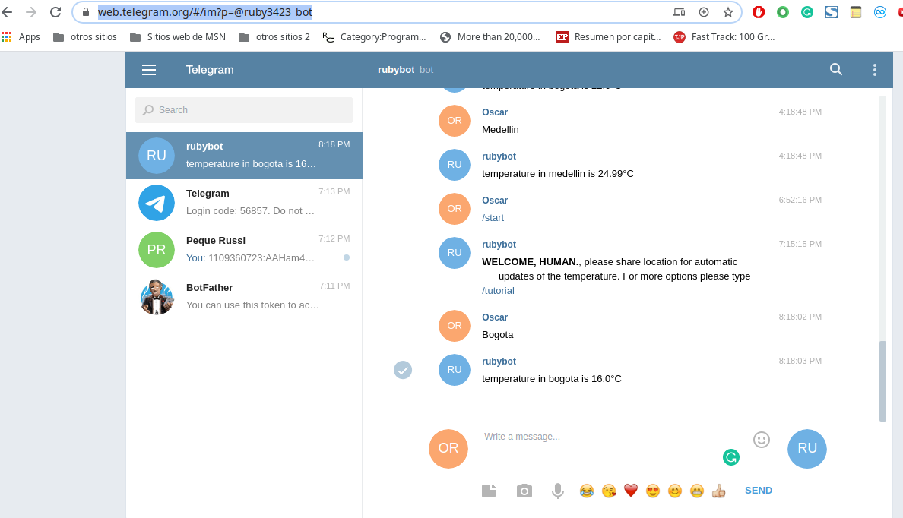
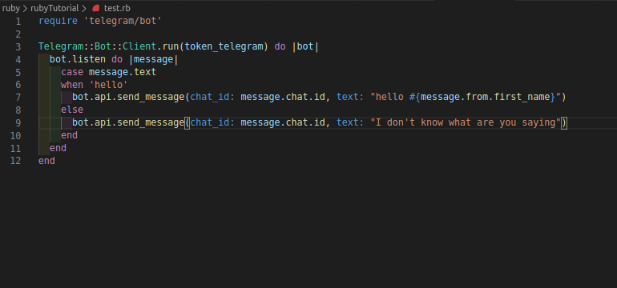

# bot-ruby

Capstone project for Ruby course in Microverse

# enumerable-module-ruby test

Eight Microverse project for Ruby Course

# What it does

- I have created a bot in telegram
- This bot give info about temperature
- it can use the city name, coordinates (latitude and longitude), or zip code to get the information
- if the user shares his location bot will give him /her an update of the temperature in the city using an interval of time.
- By default the interval is 60 seconds but can be modified using /interval message
- to learn more about how to use the bot type /start and /tutorial
- To make the project work in another environment is necessary to install three gems, to do it run:
* gem install telegram-bot-ruby
* gem install openweather2
* gem install geocoder

## Built With

- Ruby
- Telegrem API [Link](https://core.telegram.org/bots/api)
- Geocoder API [Link](http://www.rubygeocoder.com/)
- Openweather2 [Link](https://openweathermap.org/)

#### and deployed to GitHub

## Tutorial
- On telegram look for ruby3423_bot and type **/start** to begin
- type **/tutorial** for the tutorial with all the commands you can use to communicate with the bot

* **Miami**
* Get temperature of miami
* **coord:  4.5 74.25**
* Get temperature of place with latitude 4.5 and longitude 74.25
* **zip:  33101**
* Get temperature of place with zip code 33101
* **/format c**
* Use celsius format, the other options are f (farenheit) and k (kelvin)
* **/interval 10m**
* updates of temperature every 10 minutes,
* the other options are s (seconds), h (hour), d (days)
* **/no_more**
* Stop automatic updates of the temperature

## How to create a bot in Telegram

1) look for user botfather in telegram, this is the bot that control all the bots
2) type /start to request a bot
3) type name of your bot
4) save the token botfather will give you because you will need that token to control your bot
5) run **gem install telegram-bot-ruby**  and add **require "telegram/bot"** in your project
6) try something like this

In the image example the bot answer "hello name-of-the-user" if user type hello, otherwise it send the message "I dont know what are you saying"

## Live Demo

[Live Demo](https://web.telegram.org/#/im?p=@ruby3423_bot)

## Project Presentation (Video)

[Project Presentation](https://www.loom.com/share/42f6a6ae69dd47ce8c600cc0db2b74f7)

## Authors

**Oscar Russi**
- Github: [@andresporras3423](https://github.com/andresporras3423/)
- Linkedin: [Oscar Russi](https://www.linkedin.com/in/oscar-andr%C3%A9s-russi-porras-053236167/)

## 🤝 Contributing

This is a project for educational purposes only. We are not accepting contributions.

## Attributions and Credit

Special thanks to Microverse, for this learning opportunity. 

## Show your support

Give a ⭐️ if you like this project!

## Enjoy!